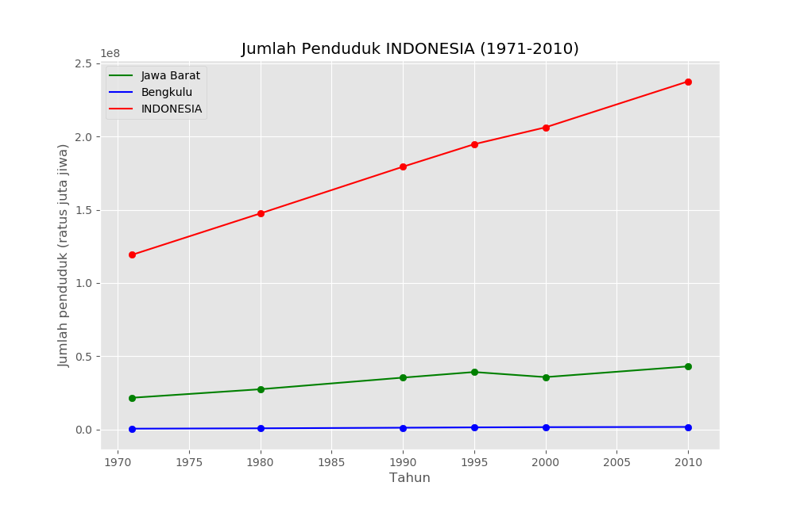
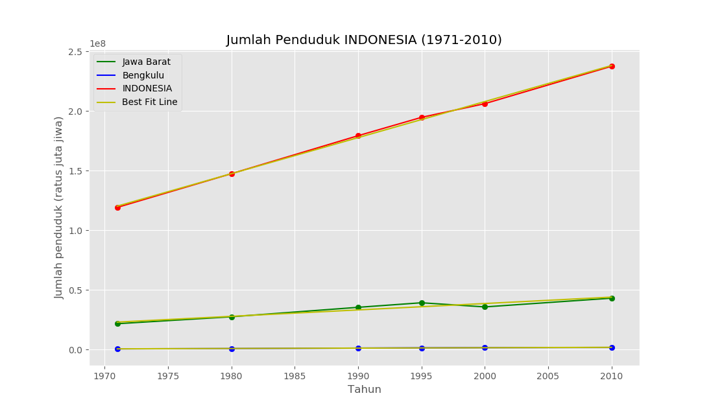

# Machine Learning Exercises


#

### **Soal 1 - Jumlah Penduduk Indonesia**

Disediakan __1 buah dataset (file Excel)__ hasil sensus BPS (Badan Pusat Statistik) tentang jumlah penduduk Indonesia berdasarkan provinsi pada tahun 1971, 1980, 1990, 1995, 2000 & 2010. Unduh dataset via BPS: [unduh di sini](https://www.bps.go.id/statictable/2009/02/20/1267/penduduk-indonesia-menurut-provinsi-1971-1980-1990-1995-2000-dan-2010.html). __Dilarang keras untuk menyunting/mengubah konten dataset!__ Kemudian dengan memanfaatkan dataset tersebut, selesaikanlah soal-soal berikut:

1. Buatlah sebuah file yang dapat menampilkan grafik: *(1)* jumlah penduduk __Indonesia__, *(2)* jumlah penduduk dari provinsi yang memiliki __*penduduk terbanyak di tahun 2010*__, dan *(3)* jumlah penduduk dari provinsi yang memiliki __*penduduk paling sedikit di tahun 1971*__! 

    Provinsi dengan jumlah penduduk terbanyak di tahun 2010 adalah __Jawa Barat__, dan provinsi dengan jumlah penduduk paling sedikit di tahun 1971 adalah __Bengkulu__. Namun Anda __dilarang__ untuk menuliskan kata _"Jawa Barat"_, _"Bengkulu"_ dan _"Indonesia"_ di dalam file Anda. Hasil yang diharapkan kurang lebih ditunjukkan oleh grafik berikut:

    

2. Dalam satu file yang sama, buatlah tampilan __regresi linear__ terhadap hasil di soal sebelumnya, untuk memprediksi jumlah penduduk di masa mendatang. _(1)_ Gambarkan _best fit line_ (garis terbaik) hasil regresi pada grafik, dan _(2)_ prediksikan berapa jumlah penduduk Indonesia, Jawa Barat & Bengkulu pada tahun 2050! 

    Anda __dilarang__ untuk menuliskan kata _"Jawa Barat"_, _"Bengkulu"_ dan _"Indonesia"_ di dalam file Anda. Hasil yang diharapkan kurang lebih ditunjukkan oleh gambar berikut:

    

    Dan di terminal akan muncul hasil prediksi: 

    ```bash
    Prediksi jumlah penduduk Jawa Barat di tahun 2050: 65443585
    Prediksi jumlah penduduk Bengkulu di tahun 2050: 3139135
    Prediksi jumlah penduduk INDONESIA di tahun 2050: 359273669
    ```

_**Catatan:**_ _Lampiran jawaban dalam bentuk file sensus.ipynb yang sudah diupload_

#

### **Soal 2 - Diagnosis Kesuburan**

Disediakan __1 buah dataset__ (*fertility.csv*) yang menunjukkan kondisi fisik, kebiasaan & rutinitas sehari-hari beberapa pasien wanita, berkaitan dengan tingkat kesuburannya. Unduh dataset bisa download langsung dari sumbernya: [klik sini](https://www.kaggle.com/gabbygab/fertility-data-set).

Dari dataset tersebut buatlah sebuah __file python__ yang mengandung __3 buah algoritma model machine learning__ (pilihan model bebas), kemudian buatlah prediksi diagnosis kesuburan terhadap profil wanita berikut berdasarkan 3 model yang Anda pilih:

- 👩‍🔧 __Arin (*Montir, 29 th*)__
    
    Sejak kecil terkenal sehat & lincah, tak pernah mengalami penyakit serius. Usai menjadi Sarjana Teknik, Arin meneruskan usaha bengkel ayahnya. Setiap hari menghabiskan 5 jam untuk duduk, sembari merokok & mengkonsumsi alkohol.

- 👩‍🍳 __Bebi (*Chef, 31 th*)__

    Memutuskan fokus menggeluti bidang kuliner setelah 10 tahun yang lalu kakinya terpaksa diamputasi lantaran kecelakaan lalu lintas. Tidak merokok namun dalam seminggu beberapa kali mengkonsumsi alkohol.

- 👩‍🌾 __Caca (*Gardener, 25 th*)__

    Pecinta lingkungan yang terobsesi dengan gaya hidup sehat. Sayangnya daya tahan tubuhnya lemah. Sedari kecil hingga kini, Caca kerap kali terjangkit penyakit, terutama batuk, pilek & demam. Dalam sehari, 7 jam ia habiskan untuk duduk.

- 👩‍🎓 __Dini (*Dosen, 28 th*)__

    Dosen muda ini 2 bulan lalu baru saja menjalani operasi patah tulang rusuk, akibat cedera saat berolahraga. Kini ia terpaksa duduk di kursi roda, selama masih dalam masa penyembuhan hingga 1 bulan ke depan. Setiap hari Dini merokok, namun sangat anti pada alkohol.

- 👩‍⚕ __Enno (*Dokter, 42 th*)__

    Semasa kecil, Enno kerap kali terjangkit asma akut. Bahkan pernah menjalani perawatan intensif akibat _bronkitis_. Kini sebagai dokter umum, ia senantiasa menjaga kebersihan & kesehatan. Dalam sehari, 8 jam ia habiskan untuk melayani konsultasi pasien di poli umum.

Output yang diharapkan hanya menampilkan di _terminal_, prediksi diagnosis terhadap 5 profil wanita di atas menurut 3 algoritma model machine learning yang Anda pilih. Misal:

```bash
Arin, prediksi kesuburan: NORMAL (Logistic Regression)
Arin, prediksi kesuburan: NORMAL (K-Nearest Neighbors)
Arin, prediksi kesuburan: NORMAL (Random Forest)
... 
```

_**Catatan:**_ _Lampiran jawaban dalam bentuk file kesuburan.ipynb yang sudah diupload_

#

## **Soal 3 - Hunting Pemain Bola ⚽**


Anda adalah seorang manager klub sepakbola ternama yang ingin merekrut pemain sepakbola muda berbakat. Pemain yang Anda targetkan untuk direkrut memiliki kriteria sebagai berikut:

- [x] Usia (__Age__) __<= 25__ tahun, 
- [x] Skill umum (__Overall__) __>= 80__ point, dan
- [x] Potensi (__Potential__) __>= 80__ point. 

Tersedia __1 buah dataset (.csv)__ yang memuat data lengkap pemain sepakbola profesional kelas dunia. Unduh dataset via Kaggle: [klik di sini](https://www.kaggle.com/karangadiya/fifa19). __Dilarang keras untuk menyunting/mengubah konten dataset!__ 

Dengan memanfaatkan dataset tersebut, buatlah sebuah file __python (.py)__ atau kernel __Jupyter notebook (.ipynb)__ yang berisi model Machine Learning yang dapat mengklasifikasikan pemain yang Anda targetkan untuk direkrut. Gunakan minimal __3 buah algoritma model machine learning__ _(pilihan model bebas)_, lalu bandingkan & tentukan model mana yang memiliki akurasi terbaik. Kemudian gunakan model tersebut untuk mengklasifikasikan data __pemain di bawah ini__ apakah tergolong pemain yang patut Anda rekrut atau tidak:

Name | Club | Nationality | Age | Overall | Potential
--|--|--|--|--|--
Andik Vermansyah | Madura United FC |  Indonesia | 27 | 87 | 90
Awan Setho Raharjo | Bhayangkara FC |  Indonesia | 22 | 75 | 83
Bambang Pamungkas | Persija Jakarta |  Indonesia | 38 | 85 | 75
Cristian Gonzales | PSS Sleman |  Indonesia | 43 | 90 | 85
Egy Maulana Vikri | Lechia Gdańsk |  Indonesia | 18 | 88 | 90
Evan Dimas | Barito Putera |  Indonesia | 24 | 85 | 87
Febri Hariyadi | Persib Bandung |  Indonesia | 23 | 77 | 80
Hansamu Yama Pranata | Persebaya Surabaya |  Indonesia | 24 | 82 | 85
Septian David Maulana | PSIS Semarang |  Indonesia | 22 | 83 | 80
Stefano Lilipaly | Bali United |  Indonesia | 29 | 88 | 86

_**Catatan:**_ _Lampiran jawaban dalam bentuk file footballplayer.ipynb yang sudah diupload_

#

## **Soal 4 - Hunting Pemain Basket 🏀**


Anda adalah seorang manager klub basket ternama yang ingin merekrut pemain basket muda berbakat. Pemain yang Anda targetkan untuk direkrut memiliki kriteria sebagai berikut:

- [x] Usia (__Age__) __<= 25__ tahun, 
- [x] Tinggi badan (__Height__) __>= 180__ cm,
- [x] Berat badan (__Weight__) __<= 90__ kg,
- [x] Rata-rata point (__Average points scored__) __>= 6__, dan
- [x] Rata-rata rebound (__Average rebounds grabbed__) __>= 3__.

Tersedia __1 buah dataset (.csv)__ yang memuat data lengkap pemain basket liga profesional __NBA__ (_National Basketball Association_). Unduh dataset via Kaggle: [klik di sini](https://www.kaggle.com/justinas/nba-players-data). Dengan memanfaatkan dataset tersebut, buatlah sebuah file __Jupyter notebook (.ipynb)__ yang berisi model machine learning untuk mengklasifikasikan data __pemain muda Indonesia di bawah ini__ apakah tergolong pemain yang patut Anda rekrut atau tidak:

Name | Club | Country | Age | Height | Weight | Avg Points | Avg Rebounds 
--|--|--|--|--|--|--|--
Andakara Prastawa Dyaksa | Pelita Jaya Bakrie |  Indonesia | 24 | 190 | 90 | 7 | 6
Reggie Mononimbar | Pelita Jaya Bakrie |  Indonesia | 21 | 185 | 86 | 6 | 3
Hardianus Lakudu | Satria Muda Pertamina Jakarta |  Indonesia | 23 | 178 | 83 | 10 | 3
Kevin Yonas Sitorus | Satria Muda Pertamina Jakarta |  Indonesia | 26 | 185 | 75 | 11 | 4
Arki Dikania Wisnu | Satria Muda Pertamina Jakarta |  Indonesia | 20 | 183 | 80 | 5 | 2
Laurentius Steven Oei | Satria Muda Pertamina Jakarta |  Indonesia | 21 | 191 | 85 | 4 | 10
Mei Joni | Stapac |  Indonesia | 25 | 188 | 90 | 7 | 5
Vincent Rivaldi Kosasih | Stapac |  Indonesia | 23 | 179 | 87 | 1 | 2
Hardian Wicaksono | Pacific Caesar Surabaya |  Indonesia | 21 | 177 | 80 | 9 | 8
Brandon Jawato | Louvre Surabaya |  Indonesia | 24 | 182 | 85 | 6 | 5

__Requirements:__

- Buatlah sebuah file __Jupyter Notebook (.ipynb)__.
- Download & gunakan dataset [NBA players](https://www.kaggle.com/justinas/nba-players-data). Bersihkan data, lakukan split menjadi __80%__ untuk training set & __20%__ untuk testing set.
- Buatlah __3 model__ machine learning untuk klasifikasi (pilihan  model bebas) untuk menentukan nilai parameter terbaik tiap model.
- Gunakan parameter terbaik model untuk melakukan prediksi pada testing set. Kemudian bandingkan nilai tiap model & gunakan model terbaik yang diperoleh, untuk mengklasifikasi data pada tabel pemain muda Indonesia di atas, manakah pemain yang patut direkrut atau tidak. Tampilkan hasilnya dalam sebuah __dataframe__.

_**Catatan:**_ _Lampiran jawaban dalam bentuk file basketplayer.ipynb yang sudah diupload_

#

### **Soal 5 - Rekomendasi Buku Bagus**

Disediakan __beberapa dataset__ seputar buku populer beserta ratingnya. File **_books.csv_** berisi data lengkap 10.000 buku populer di dunia, sedangkan file _**ratings.csv**_ berisi data user yang memberikan rating (_1 sampai 5_) terhadap buku-buku populer. Unduh dataset langsung dari sumbernya: [klik sini](https://github.com/zygmuntz/goodbooks-10k).

Dari dataset tersebut buatlah sebuah __*content-based filtering recommender system*__ yang dapat memberikan __*5 rekomendasi buku*__ terhadap beberapa _history_ user berikut:

- 👨‍🔧 __Andi (*Montir, 30 th*)__

    Judul buku yang pernah dibaca | Rating yang diberikan
    -----|-----
    The Hunger Games | ⭐⭐⭐⭐⭐
    Catching Fire | ⭐⭐⭐⭐⭐
    Mockingjay | ⭐⭐⭐⭐
    The Hobbit or There and Back Again | ⭐⭐⭐⭐
    Animal Farm: A Fairy Story | ⭐

- 👨‍🍳 __Budi (*Chef, 23 th*)__

    Judul buku yang pernah dibaca | Rating yang diberikan
    -----|-----
    Harry Potter and the Philosopher's Stone | ⭐⭐⭐⭐⭐
    Harry Potter and the Chamber of Secrets | ⭐⭐⭐⭐⭐
    Harry Potter and the Prisoner of Azkaban | ⭐⭐⭐⭐⭐
    
- 👨‍🌾 __Ciko (*Gardener, 26 th*)__

    Judul buku yang pernah dibaca | Rating yang diberikan
    -----|-----
    The Brightest Star in the Sky | ⭐⭐
    The Last Seven Months of Anne Frank | ⭐
    The Venetian Betrayal | ⭐⭐
    Robots and Empire | ⭐⭐⭐⭐⭐

- 👨‍🎓 __Dedi (*Dosen, 40 th*)__

    Judul buku yang pernah dibaca | Rating yang diberikan
    -----|-----
    Nine Parts of Desire: The Hidden World of Islamic Women | ⭐⭐⭐⭐
    "A History of God: The 4,000-Year Quest of Judaism, Christianity, and Islam" | ⭐⭐⭐⭐⭐
    "No god but God: The Origins, Evolution, and Future of Islam" | ⭐⭐⭐⭐
    Hunter × Hunter #1 | ⭐ 
    Peter Pan | ⭐⭐

- 👨‍⚕ __Ello (*Doctor, 35 th*)__

    Judul buku yang pernah dibaca | Rating yang diberikan
    -----|-----
    Being Mortal: Medicine and What Matters in the End | ⭐⭐ 
    George's Marvellous Medicine | ⭐⭐
    Doctor Sleep | ⭐⭐⭐⭐
    The Story of Doctor Dolittle | ⭐⭐⭐⭐⭐
    Bridget Jones's Diary | ⭐⭐⭐⭐⭐

Output yang diharapkan hanya menampilkan di _terminal_, __*5 rekomendasi buku*__ terhadap 5 profil user di atas berdasarkan _content-based filtering_. Misal:

```bash
1.  Buku bagus untuk Andi:
    - The Hunger Games Box Set
    - Harry Potter and the Philosopher's Stone
    - Harry Potter and the Chamber of Secrets
    - The Da Vinci Code
    - Harry Potter and the Order of the Phoenix

... 
```

_**Catatan:**_ _Lampiran jawaban dalam bentuk file rekomenbuku.ipynb yang sudah diupload_

#
